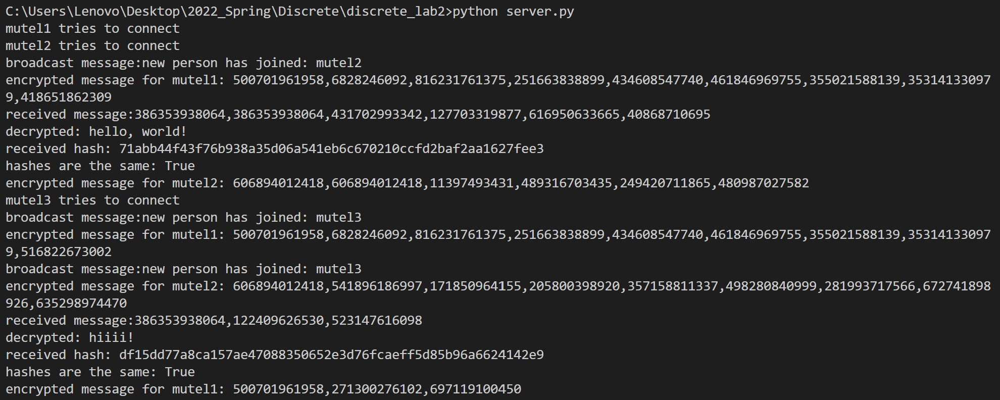

# Summary

Our task was to improve given messenger program with RSA encryption for messages.

The messenger allows users to connect to the server and write messages, which are then brodcasted for every user connected.

The code for the encryption is in encryption.py.

## Usage

Main functions from encryption module are

``` python
encrypt(msg: str, e: int, n: int) -> str
decrypt(msg: str, d: int, n: int) -> str
```

To generate public keys (n and e) and private key (d) there are two corresponding methods

``` python
# p and q have to be large prime integers (recomended bit length is 1024-4096).
# In generate_key p and q are generated with sympy.randprime()
# However, they can also be set manually.
generate_key(bit_len:int, p=0, q=0) -> tuple([int, int, int])
generate_secret_key(e:int, p:int, q:int) -> int
```

To start messaging server and at least two clients should be started.


Server logs the encrypted messages, their decryption and their hashes for every sent message.



## Tasks Done

- RSA for digital signature
- Message integrity with hashes
- Encryption algo
